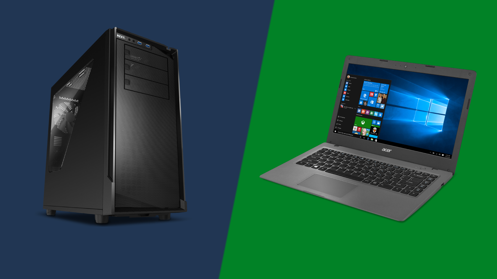
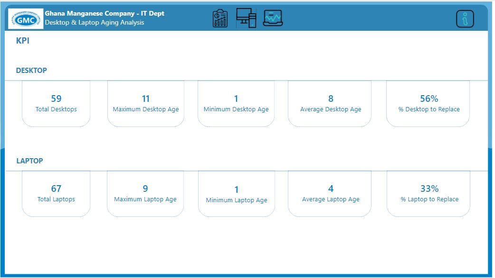
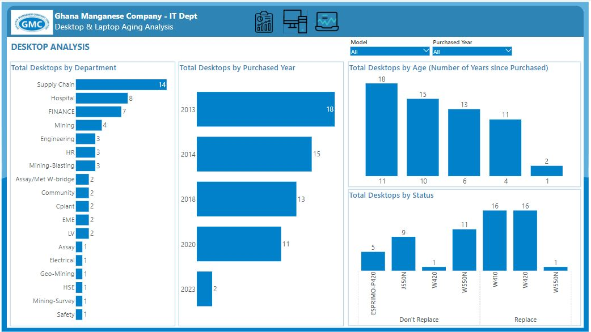
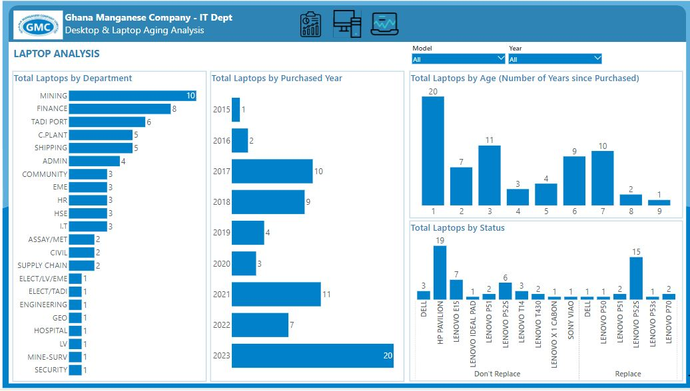
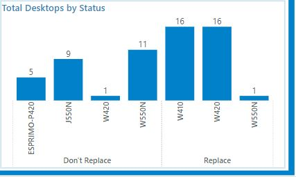
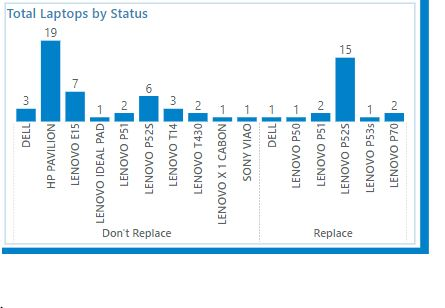

# Desktop-Laptop-Aging-Analysis

## Introduction

This analysis was performed to determine the ages of Desktops and Laptops in Ghana Manganese Company to know which of them needs to be replaced based on the age limit since purchased.

## Problem Statement

Analysis was performed to determine;
1. The ages of the desktop and laptop models?
2. Which desktop and laptop models need to be replaced?
3. What is the average desktop & laptop age?
4. What is the maximum and minimum desktop and laptop age?
5. Total Desktops and Laptops in the company?

## Skills/Concepts Demonstrated 

The following Power BI features were incorporated:
- DAX (Calculated Column)
- Measures
- Tooltips
- Filters
- Bookmarks & Selections
- Page Navigation using Icons as buttons
- Drill Throughs

## Modelling

No data was modeled since only one table was used for the analysis.

## Visualization

The report comprises 3 pages:
1. Overview Page (For KPIs)
2. Desktop Analysis Page.
3. Laptop Analysis Page.

## You can interact with the report: [here](https://app.powerbi.com/view?r=eyJrIjoiNjRhNWI3ZWYtNzY5OC00N2I4LTg4NTktMjAyZjRhMWE3Yjc5IiwidCI6IjNmYzY2NTU5LTE2MDYtNGM2MC1hYjNlLTkyMmM2MGNjYWIyNiJ9)

### Overview - Statistics                           
 

### Desktop Analysis Page

### Laptop Analysis Page

## Analysis 

### The ages of the desktop and laptop models?
- This was determined by subtracting the purchased year from the current year. The ages of the Desktops range from 1 to 11 years while the laptop's age range from 1 to 9 years.

### Which desktop and laptop models need to be replaced?
- This was determined using the number of years extracted from the purchased year. A desktop and laptop need to be replaced if the number of years is at least 6 years.
  - ##### Desktop Replacement Models
   
  - ##### Laptop Replacement Models
   
  
### What is the average desktop & laptop age?
- This was determined by using the AVERAGE() function on the Number of Years column. The average age of the Desktop is 8 years while that of the Laptop is 4 years.

### What is the maximum and minimum desktop and laptop age?
- This was determined by using the MAX() and MIN() functions on the Number of Years column. The maximum age of the Desktops is 11 years while that of the Laptops is 9 years with both devices having a minimum age of 1 year.

### What are the total Desktops and Laptops in the company?
- This was determined by using the COUNT() function on the Model column. Since the same model was bought many times, DISTINCTCOUNT() function cannot be used. The total number of desktops and laptops in the company is 59 and 67 respectively.

## Conclusion
- 56% of Desktops need to be replaced while 33% of Laptops need to be replaced.

## Data Sourcing
The data was sourced from GMC IT-Dept.

  

